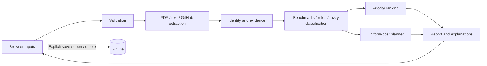

# Architecture

A vanilla JavaScript frontend calls a local FastAPI backend. SQLite holds explicitly saved reports.

Ranking orders independent suggestions; search chooses combinations under assumed costs. Neither verifies competence. See [data model](data-model.md), [workflows](workflows.md), and [ADRs](../adr/README.md).
