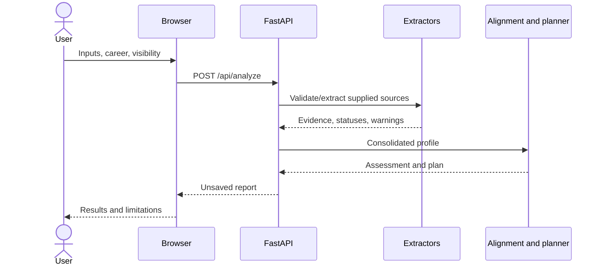
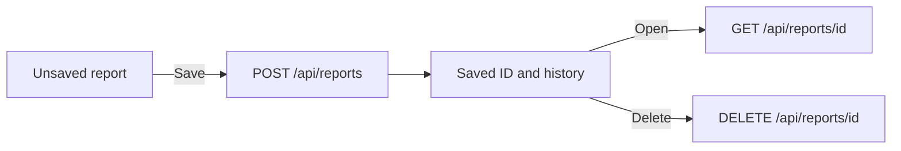

# Workflows

A source failure may still permit analysis if another source is usable. No usable evidence produces a clear error. A later failed request preserves the previous successful interface result.

